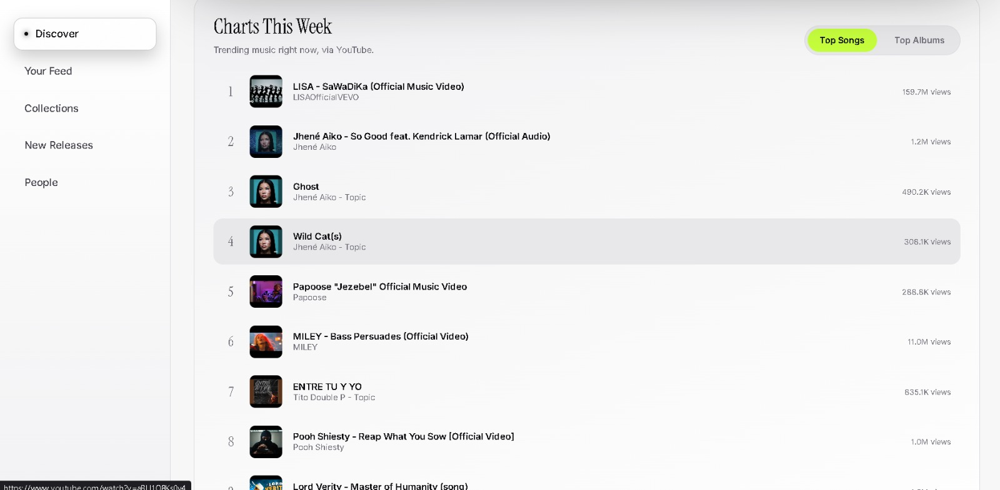
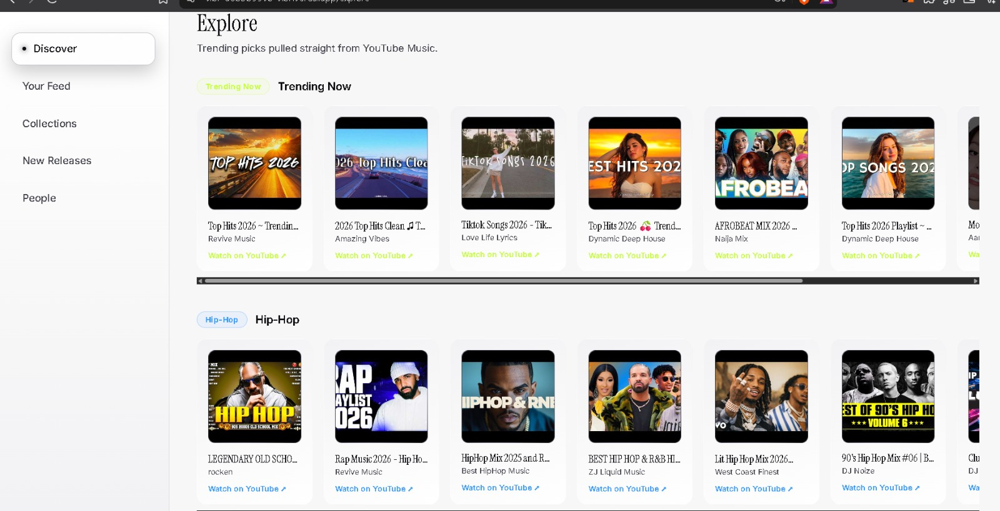
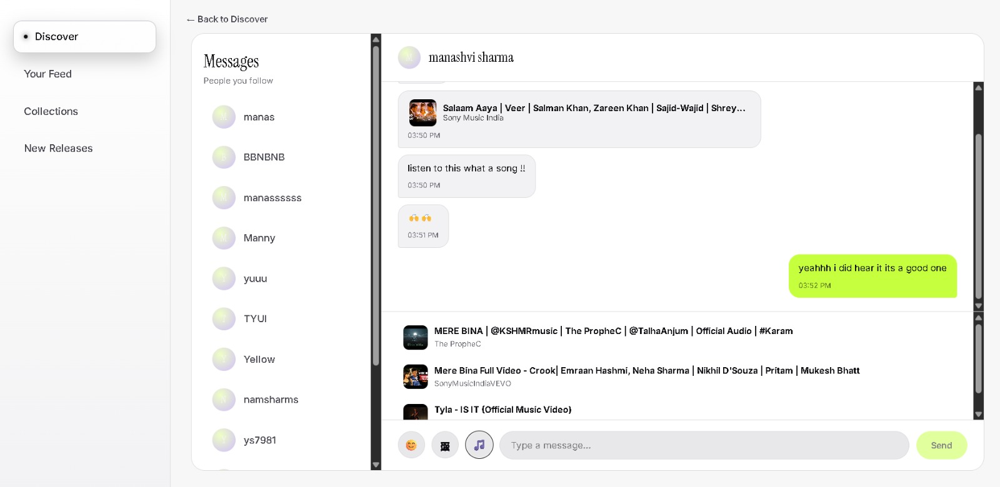
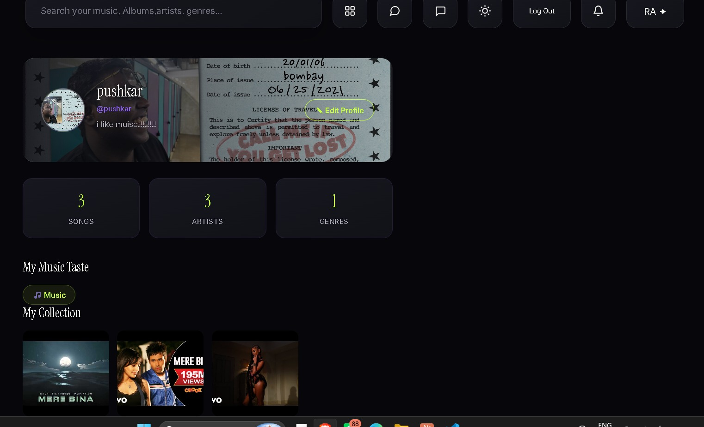

<div align="center">

# VIBR

### A social platform for discovering, exploring, and experiencing music.

<p>
  <a href="https://vibr-tau.vercel.app/">
    <strong>Live Demo</strong>
  </a>
  ·
  <a href="https://github.com/manas765/vibr/issues">
    Report a Bug
  </a>
  ·
  <a href="https://github.com/manas765/vibr/issues">
    Request a Feature
  </a>
</p>


</div>

---

# 🎵 Overview

**VIBR** is a modern social music discovery platform designed around one simple idea:

> **Discovering music should be as engaging as listening to it.**

Instead of being another traditional streaming application, VIBR focuses on the **music discovery experience**.

Users can:

- Discover new music
- Explore artists
- Search songs and albums
- Save music
- Rate songs using VIBR verdicts
- Follow other music lovers
- Share recommendations
- Track new releases
- Explore music communities
- Build their own music identity

VIBR combines a modern **React frontend**, **Supabase**, serverless APIs, and external music services to create a social-first music discovery experience.

---

# ✨ Features

## 🎧 Music Discovery

Explore music through an interactive discovery interface.

- Browse trending music
- Explore different genres
- Search songs, albums and artists
- Discover new tracks
- Save songs to your collection
- Open music directly through YouTube
- Explore personalized music interests

### Discover


---

# 🔥 Verdict-Based Ratings

VIBR does not use boring traditional star ratings.

Instead, users express how they actually feel about a song using:

| Verdict | Meaning |
|---|---|
| 🔥 **GOD LEVEL** | Absolutely incredible |
| 💜 **PERFECT** | Loved it |
| 👍 **GOOD** | Worth listening |
| 😐 **MEHHHHH** | Not really my vibe |

This makes music ratings more expressive and community-oriented.

---

# 🎤 Artist Profiles

Explore dedicated artist pages containing:

- Artist information
- Popular tracks
- Music videos
- Artist discovery
- Follow / unfollow
- Related music
- Community interaction

### Artist Page


---

# 🌎 VIBR Spaces

**Spaces** are community-driven areas where users can stay connected with what's happening in music.

Users can explore:

- Music discussions
- Artist updates
- Music news
- Community posts
- Comments
- Recommendations
- Music-related conversations

### Spaces


---

# 📊 Charts

Discover what's trending right now.

VIBR provides a dedicated charts experience with:

- Trending songs
- Trending albums
- YouTube-based music data
- View counts
- Weekly chart rankings

### Charts This Week



---

# 🔎 Explore

The Explore page allows users to discover music across multiple categories.

### Trending Now

Explore trending playlists and music currently gaining attention.

### Genre Discovery

Discover music through categories such as:

- Hip-Hop
- Pop
- R&B
- Electronic
- Rock
- Bollywood
- Indie
- And more

### Explore Page



---

# 💬 Social Messaging

Music discovery becomes more interesting when you can share it with friends.

VIBR includes a messaging experience where users can:

- Chat with people they follow
- Share songs
- Recommend music
- Send reactions
- Discuss tracks
- Discover music through conversations

### Messages



---

# 👤 Personal Music Profile

Every user gets their own music identity.

Users can manage:

- Profile information
- Profile picture
- Bio
- Saved songs
- Followed artists
- Music preferences
- Music statistics
- Personal collection

### Profile



---

# 📚 Personal Collection

Users can build their own collection of discovered music.

The collection can include:

- Saved songs
- Favorite artists
- Recently discovered music
- Recommended tracks
- Personal music history

---

# 🚀 Release Tracking

Stay updated with new music releases.

VIBR provides:

- New releases
- Upcoming releases
- Trending releases
- Release discovery
- Saved releases
- Artist release tracking

---

# 👥 Community Discovery

VIBR is built around people discovering music together.

Users can:

- Follow other users
- Discover people with similar tastes
- See what others are listening to
- Explore recommendations
- Share music
- Interact with the community

---

# 🏗️ Architecture

```text
                         ┌──────────────────┐
                         │       USER       │
                         └────────┬─────────┘
                                  │
                                  ▼
                     ┌─────────────────────────┐
                     │      VIBR FRONTEND      │
                     │    React + Vite + UI    │
                     └───────────┬─────────────┘
                                 │
              ┌──────────────────┼──────────────────┐
              │                  │                  │
              ▼                  ▼                  ▼
       ┌──────────────┐   ┌──────────────┐  ┌──────────────┐
       │   SUPABASE   │   │  API ROUTES  │  │  MUSIC APIs  │
       │              │   │              │  │              │
       │ Authentication│   │ Search       │  │ YouTube      │
       │ Profiles      │   │ Music Data   │  │ Spotify      │
       │ Saved Data    │   │ News         │  │ Music Data   │
       │ Social Data   │   │ Releases     │  │ Artists      │
       └──────────────┘   └──────────────┘  └──────────────┘