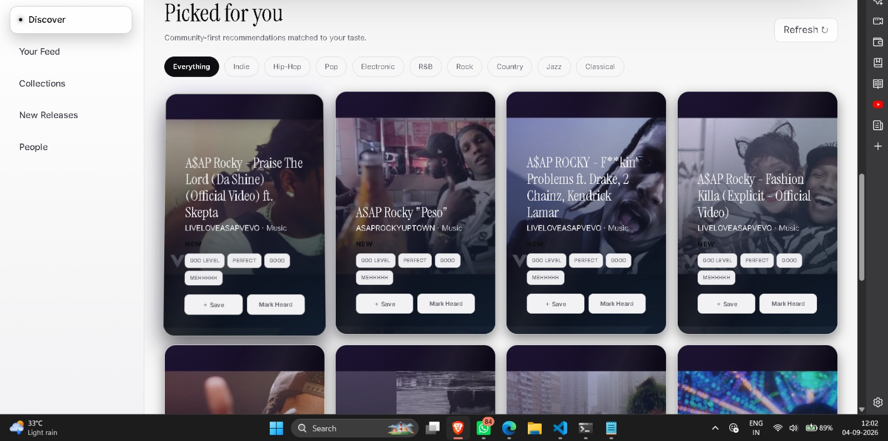
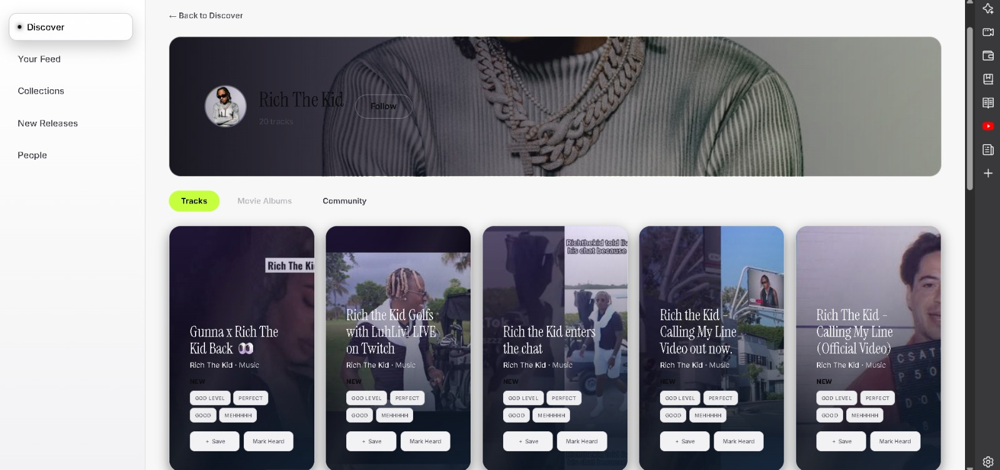
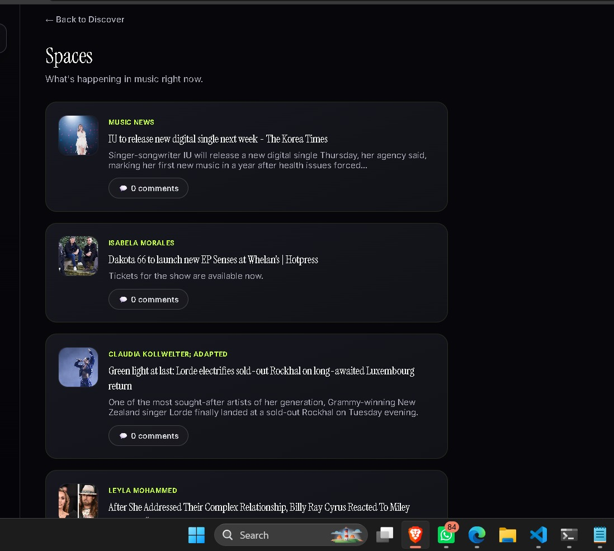

<div align="center">

# VIBR

### A social platform for discovering, exploring, and experiencing music.

<p>
  <a href="https://vibr-tau.vercel.app/"><strong>Live Demo</strong></a>
  ·
  <a href="https://github.com/manas765/vibr/issues">Report a Bug</a>
  ·
  <a href="https://github.com/manas765/vibr/issues">Request a Feature</a>
</p>


</div>

---



---

## Overview

**VIBR** is a modern social music discovery platform designed around one simple idea: **discovering music should be as engaging as listening to it**.

Instead of functioning as another traditional streaming application, VIBR focuses on the discovery experience. Users can explore music, discover artists, follow their interests, save tracks, track releases, build a personal music identity, and explore music through community-driven spaces.

The platform combines a modern React frontend with authentication, persistent user data, external music APIs, and serverless backend functionality.

---

## Key Features

### Music Discovery

Explore music through an interactive discovery interface with genre-based filtering and personalized recommendations.

- Browse music across multiple genres
- Discover tracks visually
- Search for music and artists
- Save tracks to your collection
- Rate discoveries using VIBR's verdict system

### Verdict-Based Music Ratings

Instead of traditional star ratings, VIBR uses expressive verdicts:

> **GOD LEVEL · PERFECT · GOOD · MEHHHH**

This makes music discovery feel more personal and opinion-driven.

### Artist Profiles

Explore artists through dedicated profile pages.

- Artist information
- Track exploration
- Follow and unfollow functionality
- Music videos
- Community content related to artists

<div align="center">



</div>

---

### Spaces

Stay connected with what is happening in music through VIBR Spaces.

- Music news
- Artist updates
- Community discussions
- Music-focused content
- Comment and interaction system

<div align="center">



</div>

---

### Personal Music Experience

Each user can build their own music identity through:

- Saved music
- Followed artists
- Genre preferences
- Music statistics
- Editable profiles

### Release Tracking

Keep track of music that matters.

- Recent releases
- Upcoming releases
- Announced projects
- Release filtering
- Saved releases

### Community Discovery

VIBR brings people into the music discovery process.

- Discover other users
- Follow music activity
- Explore shared interests
- Community-focused music spaces

---

## Tech Stack

### Frontend

- **React 19**
- **Vite**
- **React Router**
- **Tailwind CSS**
- **Motion**

### Backend & Services

- **Supabase** — Authentication and persistent user data
- **Vercel Functions** — Serverless API routes
- **YouTube APIs** — Music and artist discovery
- **Spotify Integration** — Music-related data and search

---

## Architecture

```text
                         ┌──────────────────┐
                         │       USER       │
                         └────────┬─────────┘
                                  │
                                  ▼
                     ┌─────────────────────────┐
                     │      VIBR FRONTEND      │
                     │    React + Vite + UI    │
                     └───────────┬─────────────┘
                                 │
              ┌──────────────────┼──────────────────┐
              ▼                  ▼                  ▼
       ┌──────────────┐   ┌──────────────┐  ┌──────────────┐
       │   SUPABASE   │   │  API ROUTES  │  │ MUSIC APIs   │
       │              │   │              │  │              │
       │ Auth         │   │ Search       │  │ Music Data   │
       │ Profiles     │   │ News         │  │ Artists      │
       │ Saved Data   │   │ Track Data   │  │ Videos       │
       └──────────────┘   └──────────────┘  └──────────────┘
